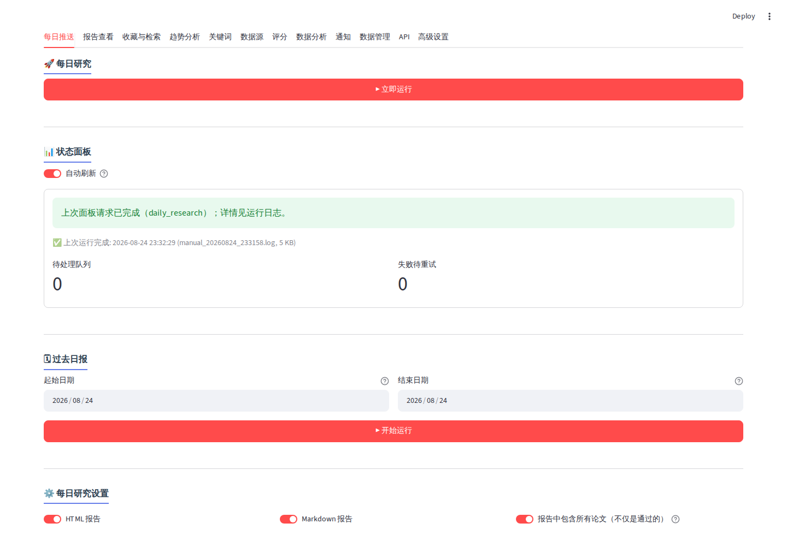
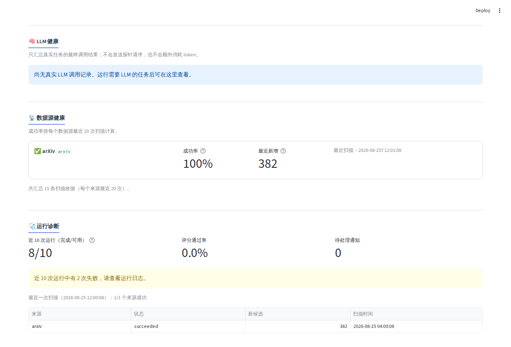
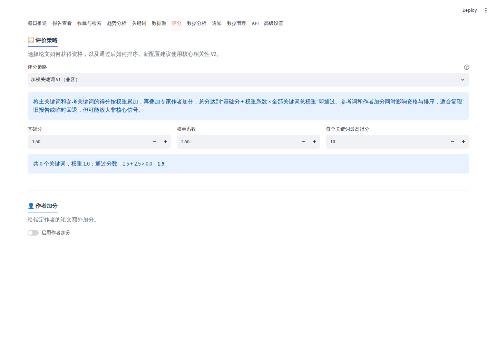
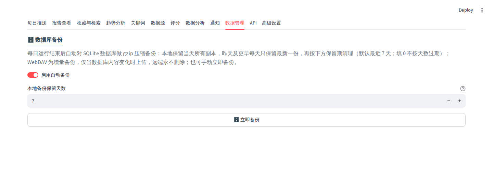
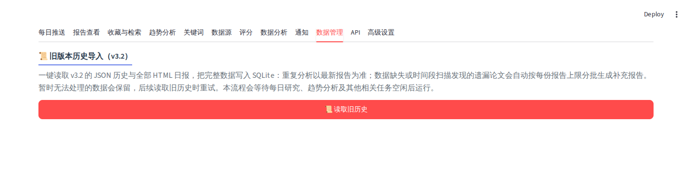

<div align="center">

# 🔬 ArXiv Daily Researcher

**A recoverable research workflow for individual researchers: discover, score, analyze, report, archive, and notify.**

[](CHANGELOG.md)
[](LICENSE)
[](https://www.python.org/)
[](docker-compose.yml)

[中文文档](README.md) · [Changelog](CHANGELOG.md) · [Issues](https://github.com/yzr278892/arxiv-daily-researcher/issues)

</div>

> [!IMPORTANT]
> SQLite is the only daily-history system in v4.0. `data/history/*_history.json` is no longer read, written, or synchronized by normal runs; it is input only for the explicit v3.2 legacy-import workflow.

ArXiv Daily Researcher is more than a daily fetcher. It turns a research run into inspectable, resumable state: candidates are fully scanned and registered first, then scored, translated, analyzed, reported, and finally committed as delivered. A transient network, LLM, notification, or WebDAV failure cannot silently discard unfinished work or make already delivered papers appear new again.

## ✨ What v4.0 guarantees

| Question | v4.0 behavior |
| :-- | :-- |
| Can a daily scan miss papers? | Daily research uses a fixed 3-day window. arXiv scans both submissions and updates with full pagination; receipts and watermarks expand recovery after a failed window. |
| What if one run finds too many papers? | Every candidate enters SQLite first. “Max papers per run” limits downstream work only, never fetching. `0` means unlimited; the remainder is durable queue work. |
| Will a retry duplicate a paper? | Exact identity is `(source, canonical_id, version)`. A new arXiv version is a new deliverable; the earlier version is preserved. |
| What happens when LLM/PDF work fails? | Completed stages are retained. Failed stages and a safe error summary stay retryable; incomplete papers are never delivered as a normal report. |
| How is v3.2 history migrated? | One click imports JSON and HTML after the worker is idle, resolves duplicates by newest analysis, records missing work, scans historical ranges, and starts supplement reports automatically. |
| How do I rerun old dates? | A date range becomes a persistent, day-by-day queue; each day uses the full daily pipeline and automatically resumes when capped. |
| How are data and notifications protected? | Consistent SQLite gzip backups, configurable local retention, incremental WebDAV archiving, and a SQLite notification outbox. |

## 📑 Contents

- [Quick start](#-quick-start)
- [Run model: scan to delivery](#-run-model-scan-to-delivery)
- [WebUI and screenshots](#-webui-and-screenshots)
- [Sources, scoring, and analysis](#-sources-scoring-and-analysis)
- [Legacy import, supplement reports, and past daily reports](#-legacy-import-supplement-reports-and-past-daily-reports)
- [Notifications, backups, and observability](#-notifications-backups-and-observability)
- [Deployment, upgrades, and CLI](#-deployment-upgrades-and-cli)
- [Complex troubleshooting](#-complex-troubleshooting)

## 🚀 Quick start

### Docker (recommended)

Requires Docker Engine and Docker Compose v2. Compose runs two services: a long-lived worker for cron, queues, and research tasks, plus a Streamlit WebUI bound to localhost by default.

```bash
git clone https://github.com/yzr278892/arxiv-daily-researcher.git
cd arxiv-daily-researcher

cp .env.example .env
# At minimum, configure CHEAP_LLM and SMART_LLM key / base URL / model.

docker compose up -d --build
docker compose ps
```

Open <http://127.0.0.1:8503> and finish configuration in the WebUI. The panel intentionally binds only to localhost. Put it behind an authenticated reverse proxy or VPN if remote access is required; do not expose it directly to the public Internet.

For a first real check, set **Max papers per run** to `5` in **Daily Push → Daily research settings**, click **Run now**, and verify reports, SQLite, notifications, and logs. Then change it back to `0` (all pending work) or your preferred normal limit.

### Local Python

```bash
python -m venv venv
source venv/bin/activate                 # Windows: venv\Scripts\activate
pip install -r requirements-core.txt
pip install -r requirements-webui.txt    # when using the WebUI

cp .env.example .env
python main.py
```

Helper scripts are available in `scripts/`. For a production self-host, Compose is preferred because it keeps the worker, logs, trigger queue, and shared data paths consistent.

## 🧭 Run model: scan to delivery

### Daily research

The normal workflow always looks back three days. There is no longer a “search last N days” setting; use the past-daily queue for earlier dates instead of making normal daily scans unbounded.

1. **Prepare and serialize**: acquire the run lock, wait for exclusive legacy-import work, then load sources, keywords, and successful scan watermarks.
2. **Fully scan and register**: arXiv fetches submitted and updated papers for every enabled category with full pagination. Every source writes a terminal receipt. Candidates are registered in SQLite before downstream work starts.
3. **Resume the right work first**: retryable failures and incomplete stages take priority over ordinary candidates. A positive run limit only caps scoring/translation/analysis; unselected work remains queued.
4. **Score and enrich**: papers are scored and translated; qualified papers with an available PDF can receive PDF extraction and SMART_LLM analysis.
5. **Atomically deliver**: only a non-empty report allows the paper-delivery ledger, run completion, notification outbox, watermarks, and maintenance work to commit. A notification/WebDAV outage does not reopen delivered papers.
6. **Maintain**: create the SQLite backup, perform configured incremental WebDAV work, retry pending notifications, and refresh usage/health data.

```text
full scan → SQLite candidate queue → score / translate / analyze → report on disk
    ↑             │                     │                       │
    └── recovery watermark └─ retryable work ─┴─ atomic delivery + outbox
```

### Report types

| Report | Trigger | Time and ordering |
| :-- | :-- | :-- |
| Daily research | cron, WebUI **Run now**, or CLI | Current execution time; ordered by filename timestamp. |
| Supplement report | Automatically after legacy import finds missing/incomplete work | Same format as daily reports, explicitly titled “Supplement”; capped by max papers per run. |
| Past daily report | WebUI date range or `backfill_run` | One persistent job per target day; filename uses target date plus actual execution time. |

HTML and Markdown outputs can be toggled independently. Daily reports live under `data/reports/daily_research/{html,markdown}/<source>/`; trend and keyword-trend reports use `trend_research/` and `keyword_trend/`.

## 🖥️ WebUI and screenshots

The WebUI has 12 tabs: Daily Push, Reports, Favorites & Search, Trend Analysis, Keywords, Data Sources, Scoring, Analytics, Notifications, Data Management, API, and Advanced Settings. Saving preserves unseen tabs’ disk values instead of overwriting them with defaults.

### Daily Push: launch, state, queue, and past dates



The state panel auto-refreshes only while work is active and shows phase heartbeats, queue counts, and a live log tail. A stop request preserves finished stages and leaves unfinished papers retryable. Past daily reports accept a start/end range rather than a single-date-only action.

### Analytics: usage, LLM health, source health, diagnostics



LLM health sends no probe request and spends no extra tokens. It summarizes final outcomes from real work only: latest call, consecutive failures, recent success rate, last success time, and a redacted failure detail for CHEAP_LLM and SMART_LLM. The same page contains persistent token usage, source scan receipts, and run diagnostics.

### Scoring policies



Policy labels and explanations are localized. Saved configuration still uses stable IDs, so changing the UI language never changes scoring behavior.

### Data management and legacy import





The screenshots were captured from the latest local WebUI with API keys, passwords, webhooks, emails, intranet addresses, and local paths excluded.

## 📡 Sources, scoring, and analysis

### Sources

- **arXiv** is the default primary source. Its toggle reveals category selection, fetch timeout, and announcement-delay recovery settings. The UI contains a searchable list of 153 top-level arXiv categories.
- **Extra sources** have their own toggle. When enabled, curated sources (PRL, PRA/PRB, Nature/Science, Hugging Face Papers, and others) plus form-validated OpenAlex journal definitions become available. Source definitions contain data only: pasted Python, import paths, and callbacks are rejected.
- **OpenAlex** is called only for enabled extra journal sources. Its API key is optional and raises official quota; the obsolete contact-email setting has been removed.
- **Semantic Scholar** is an optional TL;DR/citation enrichment service. Disabling it stops requests; it never replaces arXiv’s complete category scan.

The API tab offers separate toggles, connection tests, and official-console links for OpenAlex, Semantic Scholar, and MinerU. Provider terms and quotas change, so consult their official pages before deployment. The application rate-limits, retries transient failures, and fails fast on authentication/parameter errors.

### Three scoring policies

| Policy | Qualification | Ranking and use |
| :-- | :-- | :-- |
| **Core Relevance V2** | Weighted primary-keyword relevance must pass its threshold and at least one primary keyword must be a strong match. Reference terms and author preference cannot qualify unrelated papers. | Recommended for new setups. Reference terms and expert authors can add ranking signals after qualification. |
| **Weighted Keywords V1 (compatibility)** | Main/reference keyword relevance and author bonus accumulate against a dynamic threshold. | Good for continued use of older reports or reference-heavy configurations. |
| **Learned Preference V1** | Uses V1 qualification. | Likes/dislikes and previous V1 passes build capped, dampened keyword/author preferences that refine ranking; explicit configured keywords always dominate. |

Scoring keeps non-sensitive audit evidence. Report cards provide one-click 👍 / 👎 controls; marks are stored in SQLite, and clearing a mark is also historically recorded. Favorites & Search provides full-library search, a time-ordered favorites list, keyword statistics, and top authors. Long lists switch to native scrolling after ten rows.

### LLMs, PDFs, and keywords

- `CHEAP_LLM` handles screening, keywords, translation, and TLDR; `SMART_LLM` handles deep analysis and trend synthesis. Both use an OpenAI-compatible interface and can target cloud services, relays, or compatible local models.
- Every LLM client shares a request pool, timeout, and exponential backoff. 429/5xx/timeout/empty response errors retry; 401/403/404/400-style fatal errors fail quickly and leave a safe detail.
- **PyMuPDF** is the default local PDF parser. **MinerU** settings appear only when MinerU is selected; an unavailable MinerU call falls back to PyMuPDF.
- Reference-PDF keyword extraction is separately switchable. When disabled, extracted terms are hidden and do not affect scoring. Large keyword displays use fixed-height native scrolling.
- A separate midnight keyword-maintenance job batches semantic normalization and optional keyword-trend reports. Its failure does not block daily delivery and is retried on a later run.

### Trend research

Trend research is separate from daily delivery. It searches a keyword/date/category range, creates per-paper TLDRs, then uses SMART_LLM for a whole-set synthesis of themes, evolution, researchers, gaps, and methods. It supports a custom analysis prompt, independent HTML/Markdown outputs, and success/failure notifications.

## 📜 Legacy import, supplement reports, and past daily reports

### The v3.2 legacy importer is one complete workflow

Open **Data Management → Database Backup → Read Legacy History**. It reads old JSON history and HTML reports only when explicitly requested; all normal operations use SQLite.

1. **Idle wait and exclusion**: the trigger is queued. If daily research, trend research, keyword maintenance, or a related job is active, import waits rather than writing concurrently.
2. **Parse and merge**: v3.2 JSON and every HTML card restore metadata, scores, translations, and deep analysis. The newest duplicate analysis wins; a complete v4 record is never downgraded by older data.
3. **Register missing work**: missing cards/translations/deep analyses and temporarily unfetchable metadata go to a supplement backlog rather than being marked complete. A later import retries them.
4. **Scan the covered period**: after import, arXiv is scanned in chunks across the dates represented by old history. Missing papers are added to the same supplement backlog.
5. **Automatically make supplement reports**: import then starts the existing daily pipeline for the backlog in batches controlled by **Max papers per run**. Delivered items resolve; the rest remains persistent.

Legacy import, supplement work, and past-date queues are major tasks. They produce one consolidated result per platform. If the overall run completes with delayed/missing/failed substeps, the notification contains a short concrete issue rather than a full raw log.

### Past daily queue

Select a historical date range in **Daily Push → Past Daily Reports** and press **Start**. Every date creates a durable `backfill_queue` row and the worker claims them oldest-first:

- Each day fetches that date’s papers and runs the complete scoring, translation, optional PDF analysis, and reporting workflow.
- If a day exceeds the run cap, that same day resumes automatically in subsequent batches. A failed day records its error but does not discard later dates.
- An interruption or container restart returns unfinished work to pending instead of marking the queue successful.

## 🔔 Notifications, backups, and observability

### Multi-platform notifications

Email, WeCom, DingTalk, Telegram, Slack, and generic webhooks are supported. Templates live in `configs/templates/`; delivery requires the global switch, the channel switch, and valid channel credentials.

Daily research, trend research, legacy import with automatic supplement work, manual supplement runs, past-date range queues, and new GitHub Release detection all emit an outcome notification. SQLite outbox rows retain a temporarily failed delivery for retry. Notifications include the failed stage or issue summary, never secrets or full stack traces.

Automatic update checking **only checks and notifies** about GitHub Releases. It never pulls code, replaces images, or restarts the service.

### SQLite backup and WebDAV

| Item | Behavior |
| :-- | :-- |
| Local backup | A consistent SQLite gzip snapshot is made after each daily run. All copies from today are retained; for yesterday and older dates, only the newest copy per day remains. |
| Retention | Set any non-negative integer in WebUI. Default is 7 days; `0` disables age expiry. |
| WebDAV | Incremental: upload only when database content changed; this project never deletes remote copies. Config, SQLite history, keywords, and reports can be selected independently. |
| Restore | Data Management can export zip or import zip / gz / db. Import validates the archive and archives the previous database; stop active writers first. |

### Operational safety and observability

- Run locks, a shared idle gate, and the WebUI trigger watcher prevent conflicting jobs from writing SQLite simultaneously.
- Source receipts are persisted and watermarks advance only after complete delivery. Diagnostics show completion rate, qualification rate, notification backlog, and the latest scan.
- Final LLM outcomes appear at **Analytics → LLM Health** with redacted errors. No extra model request is made just to populate the panel.
- The log viewer has a fixed 800px height and native overflow scrolling. Other long lists have the same bounded behavior.

## 🐳 Deployment, upgrades, and CLI

### Compose operations

```bash
# Service state and health
docker compose ps

# Worker / WebUI logs
docker compose logs -f arxiv-daily-researcher
docker compose logs -f config-panel

# After a code update, rebuild and force the newest local images
git pull
docker compose build
docker compose up -d --force-recreate
docker compose ps
```

The worker uses `network_mode: host`, so on Linux/NAS it can usually reach a host-local compatible LLM at `http://127.0.0.1:<port>/v1`. The WebUI and worker must share `data/`, `logs/`, `configs/`, and `.env`; do not point one service at a different data root.

This repository currently builds local Compose images. GHCR hosting is deliberately deferred until the v4.0 feature set is stable and formally released; do not assume a remote `latest` tag is a released image yet.

### Common CLI commands

```bash
# Default daily research
python main.py

# Trend research
python main.py --mode trend_research \
  --keywords "quantum error correction" \
  --date-from 2026-01-01 --date-to 2026-03-31 \
  --categories quant-ph

# Import v3.2 history (waits for idle work itself)
python main.py --mode legacy_import

# Process an existing supplement backlog manually
python main.py --mode supplement_run

# Queue and replay a past date range
python main.py --mode backfill_run \
  --date-from 2026-01-01 --date-to 2026-01-07
```

Inside Docker, replace `python main.py ...` with:

```bash
docker compose exec arxiv-daily-researcher python main.py --mode daily_research
```

Set `daily_research.run_time` in `configs/config.json` or the **Daily Push** tab. After changing it, use the sidebar **Restart Worker** control or `docker compose restart arxiv-daily-researcher` so cron is rebuilt.

## ❓ Complex troubleshooting

<details>
<summary><b>After moving a NAS, changing DHCP, or restarting Tailscale, the container cannot resolve <code>export.arxiv.org</code>. Is this an application bug?</b></summary>

Usually no. `NameResolutionError` / `Temporary failure in name resolution` means the host, Docker, or Tailscale DNS state did not refresh. Application retries cannot repair a container with no usable resolver. Check both the host and worker:

```bash
getent hosts export.arxiv.org
docker exec arxiv-daily-researcher getent hosts export.arxiv.org
docker exec arxiv-daily-researcher cat /etc/resolv.conf
```

Repair upstream DNS on the NAS first, then recreate the services:

```bash
docker compose up -d --force-recreate
```

If DHCP DNS is persistently unreliable, create a local (uncommitted) `docker-compose.override.yml` with resolvers appropriate for your network. `100.100.100.100` is only appropriate when Tailscale MagicDNS is enabled; it is not a universal public DNS.
</details>

<details>
<summary><b>LLM Health reports “no usable body,” a run partially completes, or the supplement backlog remains. How should I diagnose it?</b></summary>

Open **Analytics → LLM Health** first. It shows real final outcomes and redacted detail. For 401/403/404/400, check model name, base URL, API key, and gateway compatibility. For 429, 5xx, timeout, DNS, or empty-body cases, the shared retry policy was already applied and unfinished papers remain retryable in SQLite. Do not manually mark them complete or delete database rows. Fix the provider/network and rerun daily or supplement work; successful earlier stages are reused.
</details>

<details>
<summary><b>I clicked “Read Legacy History” but it did not start immediately. Is the button broken?</b></summary>

Not necessarily. Import is exclusive work: if daily/trend/keyword maintenance or another related job holds the activity gate, WebUI writes a trigger and the worker waits until idle. Check **Daily Push → Status Panel / Run Logs** and `legacy_import_*.log`. Do not launch a second CLI import to make it faster; both requests wait for the same gate.
</details>

<details>
<summary><b>How do duplicate replacement, missing-data retry, and automatic supplement reports remain correct during legacy import?</b></summary>

Import merges stable paper identities and selects the newest duplicate analysis. Older v3.2 data cannot downgrade a complete v4 row. Missing cards/translations/analysis and range-scan omissions enter `supplement_backlog`; they are never labeled delivered. Import automatically starts the supplement pipeline in capped batches. Failures and cap-deferred rows persist for later import/supplement work. Back up first and avoid hand-editing SQLite tables.
</details>

<details>
<summary><b>Will a large past-date range lose remaining dates after a restart or a failure?</b></summary>

No. Each date is a durable `backfill_queue` row claimed in date order. An interruption returns the active date to pending, and a per-run cap automatically continues the same day. A failed date records its error and later dates continue; the result notification summarizes failed days and the first error. Start the queue again to recover eligible work.
</details>

<details>
<summary><b>There are many SQLite backups and different WebDAV copies. What is the safe restore procedure?</b></summary>

All snapshots from today are intentionally retained so one bad write cannot replace the only same-day recovery point. Older days retain only their newest snapshot before age retention is applied. Stop all active writers, create a current zip export, then import the target zip/gz/db. WebDAV is incremental and never pruned, so decide whether configuration, SQLite, reports, and keyword data should be restored together. Never overwrite a live database with an untrusted file.
</details>

<details>
<summary><b>Why does an update notification not automatically update the container?</b></summary>

That is intentional. Update checking only compares GitHub Releases and sends a notification; it never pulls code, rebuilds images, or restarts active research unattended. Read release notes, back up SQLite, and use the controlled Compose upgrade commands above. When GHCR is introduced, pin a tested version tag instead of blindly following `latest`.
</details>

<details>
<summary><b>Core Relevance V2 passes almost nothing, or reference terms/expert authors seem to surface irrelevant work. How should I interpret it?</b></summary>

V2 qualification requires weighted primary-keyword content relevance plus at least one strong primary match. Reference terms and expert authors cannot make an unrelated paper qualify; they only help rank papers that already qualified. Ensure the Keywords tab contains genuine primary terms, then tune core relevance and strong-match thresholds in Scoring. If your workflow is reference-term-heavy and primary terms are not curated yet, use the compatible Weighted Keywords V1 policy temporarily.
</details>

## 📁 Project layout

```text
arxiv-daily-researcher/
├── main.py                       # CLI dispatch
├── docker-compose.yml            # worker + config-panel
├── docker/Dockerfile             # multi-stage worker / webui images
├── configs/config.json           # JSONC configuration and scheduling
├── configs/templates/            # report, email, and notification templates
├── src/
│   ├── modes/                    # daily / trend / legacy / backfill workflows
│   ├── agents/                   # LLM scoring, keyword, and trend agents
│   ├── sources/                  # arXiv, OpenAlex, HF Papers, etc.
│   ├── report/                   # daily, trend, keyword-trend reports
│   ├── notifications/            # multi-channel notification outbox
│   ├── keyword_tracker/          # normalization and trend tracking
│   ├── utils/                    # SQLite, queues, locks, backup, sync, health
│   └── webui/                    # Streamlit panel and i18n
├── data/                         # SQLite, reports, queues, backups (runtime)
├── logs/                         # system and per-run logs (runtime)
├── assets/                       # README screenshots
└── tests/                        # regression and workflow tests
```

## 🧪 Verification, contribution, and license

```bash
venv/bin/pytest -q
docker compose build
docker compose up -d --force-recreate
docker compose ps
```

Please report reproducible behavior, a redacted error summary, or feature ideas through [Issues](https://github.com/yzr278892/arxiv-daily-researcher/issues). Contributions must preserve the AGPL-3.0 copyleft terms; see [LICENSE](LICENSE).

See [CHANGELOG.md](CHANGELOG.md) for complete release history.

<div align="center">

If this project helps your research, a Star is appreciated ⭐

[](https://star-history.com/#/yzr278892/arxiv-daily-researcher&Date)

</div>
